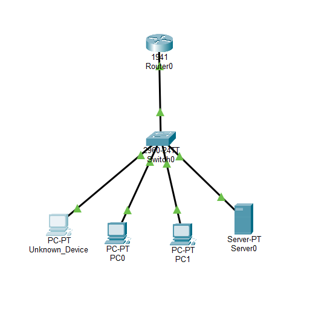
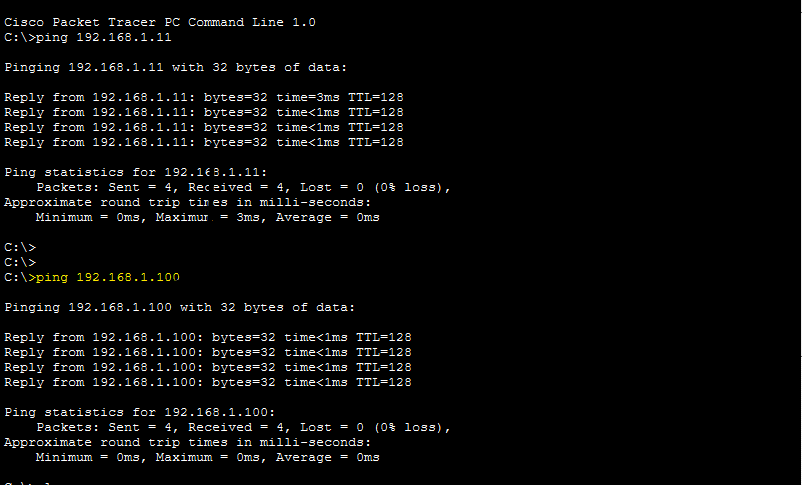

# 🛡️ SOC Analyst Home Lab using Cisco Packet Tracer

## 📌 Project Overview

This project is a hands-on SOC (Security Operations Center) Analyst Home Lab built using Cisco Packet Tracer. The objective of this project is to simulate a small enterprise network, perform asset identification, monitor network communication, investigate suspicious devices, and create basic security detection rules.

The lab is designed to demonstrate practical networking and cybersecurity concepts commonly used by SOC Analysts, Security Analysts, and Network Security Engineers.

---

## 🎯 Objectives

* Build an enterprise network topology
* Configure routers, switches, PCs, and servers
* Implement IP addressing
* Perform network connectivity testing
* Identify and investigate unknown devices
* Create incident reports
* Develop detection rules
* Simulate packet flow analysis
* Practice SOC Analyst investigation workflow

---

## 🏗️ Network Topology

### Devices Used

| Device         | Role                 | IP Address    |
| -------------- | -------------------- | ------------- |
| PC0            | Employee Workstation | 192.168.1.10  |
| PC1            | Employee Workstation | 192.168.1.11  |
| Server0        | Company Server       | 192.168.1.100 |
| Unknown_Device | Suspicious Device    | 192.168.1.50  |
| Switch0        | Layer 2 Switch       | N/A           |
| Router0        | Gateway Router       | N/A           |

### Network Diagram

---

## 🔧 Technologies Used

* Cisco Packet Tracer
* TCP/IP Networking
* Switching Concepts
* Routing Concepts
* ICMP (Ping)
* Asset Inventory
* Security Monitoring
* Incident Response Fundamentals
* Detection Rule Creation

---

## 🧪 Lab Activities Performed

### ✅ Enterprise Network Setup

* Added Router
* Added Switch
* Added PCs
* Added Server
* Configured physical connectivity

### ✅ IP Address Configuration

Configured static IP addresses for all systems.

### ✅ Connectivity Testing

Performed successful ping tests between:

* PC0 ↔ PC1
* PC0 ↔ Server0

### ✅ Packet Flow Analysis

Used Packet Tracer Simulation Mode to visualize packet movement.

### ✅ Asset Inventory Creation

Created an inventory of authorized systems.

### ✅ Suspicious Device Detection

Introduced an unknown device into the network.

Investigated:

* IP Address
* Network Location
* Communication Behavior

### ✅ Incident Reporting

Created a security incident report documenting suspicious activity.

### ✅ Detection Rule Development

Implemented custom SOC detection rules including:

#### Rule 001

Unknown Device Accessing Server

#### Rule 002

Network Scanning Detection

---

## 🚨 Sample Security Incident

### Alert

Unknown Device Detected

IP Address:

192.168.1.50

### Investigation Steps

1. Identify device
2. Verify asset ownership
3. Check communication activity
4. Assess risk level
5. Document findings

### Result

Device marked as suspicious and flagged for investigation.

---

## 📂 Project Structure

SOC-Analyst-Lab

├── Network-Topology

├── Incident-Reports

├── Detection-Rules

├── Screenshots

└── README.md

---

## 📸 Screenshots

### Network Topology

### Successful Ping Test

### Simulation Packet Flow

### Unknown Device Investigation

---

## 🧠 SOC Analyst Skills Demonstrated

* Network Fundamentals
* Asset Management
* Security Monitoring
* Alert Investigation
* Incident Documentation
* Detection Engineering Basics
* Packet Analysis
* Security Reporting
* Network Troubleshooting

---

## 🚀 Future Enhancements

* VLAN Segmentation
* Access Control Lists (ACLs)
* Port Security
* Syslog Server Integration
* SIEM Integration
* IDS/IPS Simulation
* Brute Force Detection
* Network Scanning Detection
* Malware Traffic Simulation

---

## 👨‍💻 Author

**Yash Naik**

Cybersecurity Enthusiast | SOC Analyst Aspirant | Network Security Learner

---

## ⭐ Support

If you found this project useful, consider giving it a star ⭐ on GitHub.

This repository is part of my cybersecurity learning journey and SOC Analyst portfolio development.
